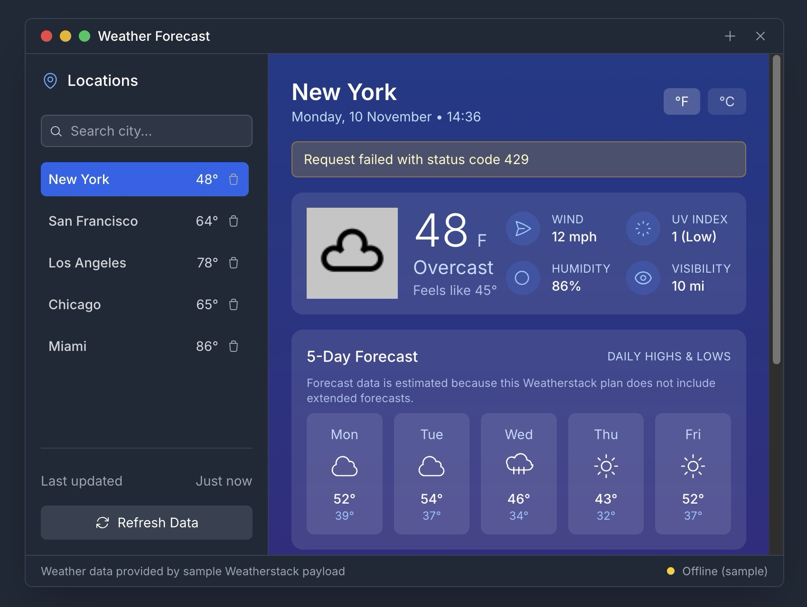

# World Weather Dashboard



Full-stack Weatherstack client with a React + Vite frontend and an Express proxy backend. The app keeps the Weatherstack API key on the server while delivering a rich dashboard for multiple locations, current conditions, 5-day forecasts, air quality, and detailed metrics.

## Get Started

### 1. Clone the repository

```bash
git clone <repo-url>
```

### 2. Install dependencies

Install dependencies separately for backend and frontend.

**Backend**

```bash
cd world-weather
cd backend
npm install
```

**Frontend**

```bash
cd world-weather
cd frontend
npm install
```

### 3. Add your API keys

1. In `backend`, copy `.env.example` → `.env`.
2. Set `WEATHERSTACK_API_KEY` (required) plus optional overrides like `WEATHERSTACK_BASE_URL` and `WEATHERSTACK_TIMEOUT_MS`.
3. In `frontend`, copy `.env.example` → `.env` and set `VITE_API_BASE_URL` (default `http://localhost:4000`).

### 4. Start the servers

**Backend**

```bash
cd backend
npm run dev
```

**Frontend**

```bash
cd frontend
npm run dev
```

Visit `http://localhost:5173` (Vite default) with the backend running on `http://localhost:4000`.

## Features Implemented

### 1. Weather & Forecast Retrieval

- Queries Weatherstack via backend proxy (`/api/weather/{endpoint}`) keeping the API key server-side.
- Attempts 5-day forecast first; falls back to current conditions with synthetic forecast generation.
- Graceful degradation to sample data when offline or rate-limited.

### 2. Location Management

- Preset cities plus add/search/remove custom locations.
- LocalStorage persistence and quick switching.

### 3. Dashboard UI

- Current weather snapshot with feels-like, wind, humidity, visibility, UV.
- 5-day forecast strip with icons and highs/lows.
- Air quality breakdown (PM2.5, PM10, O₃) with EPA index status.
- Additional details: sunrise, sunset, moon phase, precipitation, chance of rain.
- Unit toggle (°F/°C) and status messaging (online/partial/sample).

### 4. Resilience & Caching

- In-memory cache with TTL to avoid duplicate fetches.
- Inline status/error messaging and sample payload fallback.
- Health check endpoint (`/health`) for backend readiness.

## Tech Stack

### Backend

- **Node.js** with **Express**
- **Axios** for Weatherstack calls
- **CORS** enabled for local dev

### Frontend

- **React 18** with Hooks
- **Vite** for dev/build
- **Tailwind CSS** for styling

## API Endpoint

```
GET http://localhost:4000/api/weather/{endpoint}?query={location}&...
```

**Parameters:**

- `endpoint` (optional) – defaults to `current`; supports `forecast`, `historical`, etc.
- Other query params are forwarded (e.g., `query`, `forecast_days`, `hourly`, `units`, `language`).

**Response:**

- JSON payload from Weatherstack with errors normalized when missing keys.

## Usage Flow

1. User selects or searches a location.
2. Frontend requests `/api/weather/forecast` (with `forecast_days`, `hourly`).
3. If forecast fails, frontend retries `/api/weather/current` and synthesizes a 5-day forecast.
4. Results hydrate dashboard cards; cache stores payload for subsequent requests.
5. Status bar indicates provider state (online/partial/sample).

## Key Components

### Frontend

- **App.jsx** – orchestration, caching, fallback logic, unit toggles.
- **LocationSidebar** – preset/custom locations, search, persistence.
- **CurrentWeatherCard** – primary conditions and metrics.
- **ForecastStrip** – 5-day visual forecast.
- **AirQualityCard** / **WeatherDetailsCard** – AQI + detailed metrics.
- **StatusBar** – provider/status messaging.

### Backend

- **src/server.js** – Express proxy for Weatherstack with key stripping, timeout control, and 404 handling.

## Notes

- Backend must run for live data; frontend ships with sample payload for offline fallback.
- `WEATHERSTACK_API_KEY` is mandatory on the server; `access_key` sent from clients is ignored.
- Update `VITE_API_BASE_URL` if backend runs on a different host/port.

## Future Enhancements

- Improved loading/progress states and toasts.
- Richer air quality metrics and charts.
- Saved location profiles synced across devices.
- Optional deployment steps/scripts and Docker setup.

## Project Structure

```
world-weather/
├─ frontend/   # React + Vite SPA (UI, caching, formatting helpers)
├─ backend/    # Express proxy that signs Weatherstack requests
└─ _assets/    # Design references and documentation artifacts
```

For deeper details, see [frontend/README.md](frontend/README.md) and [backend/README.md](backend/README.md).
